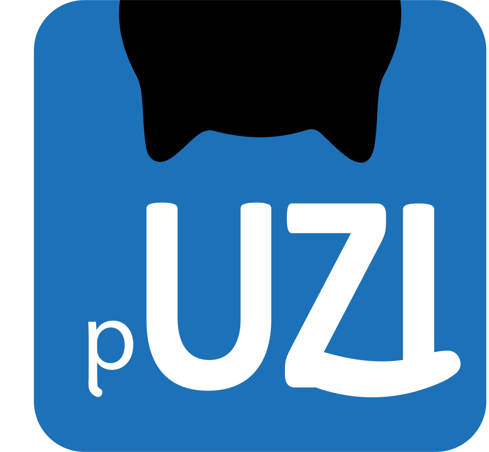

# pUZI php

[](https://github.com/minvws/pUZI-php/actions/workflows/test.yml)

Proficient UZI pass reader in php.

The UZI card is part of an authentication mechanism for medical staff and doctors working in the Netherlands. The cards are distributed by the CIBG. More information and the relevant client software can be found at www.uziregister.nl (in Dutch).

pUZI is a simple and functional module which allows you to use the UZI cards as authentication mechanism. It consists of:

1. a reader that reads the data on the card and gives an UziUser object in return (this repository).
2. middleware (currently only for the Laravel framework) that allows authentication and user creation based on UZI cards.

pUZI is available under the EU PL licence. It was created early 2021 during the COVID19 campaign as part of the vaccination registration project BRBA for the ‘Ministerie van Volksgezondheid, Welzijn & Sport, programma Realisatie Digitale Ondersteuning.’

Questions and contributions are welcome via [GitHub](https://github.com/minvws/pUZI-php/issues).

## Requirements

* PHP >= 7.3

Apache config (or NginX equivalent):
```apacheconf
SSLEngine on
SSLProtocol -all +TLSv1.3
SSLHonorCipherOrder on
SSLCipherSuite ECDHE-RSA-AES128-GCM-SHA256:ECDHE-RSA-AES256-GCM-SHA384:ECDHE-RSA-CHACHA20-POLY1305:DHE-RSA-AES128-GCM-SHA256:DHE-RSA-AES256-GCM-SHA384
SSLVerifyClient require
SSLVerifyDepth 3
SSLCACertificateFile /path/to/uziCA.crt
SSLOptions +StdEnvVars +ExportCertData
```

## Installation

### Composer

```sh
composer require minvws/puzi-php
```

### Manual

Add the following to your `composer.json` and then run `composer install`.

```json
{
    "require": {
        "minvws/puzi-php": "^0.2"
    }
}
```

## Usage

```php

// Request from your framework/controller
$uzi = new \MinVWS\PUZI\UziReader();
$user = $uzi->getDataFromRequest($request);
print $user->getUziNumber();

// In case of no request (deprecated):
$uzi = new \MinVWS\PUZI\UziReader();
$user = $uzi->getData();

print $user->getUziNumber();
var_dump($user->toArray());
```

```text
array(9) {
  'givenName' =>
  string(4) "john"
  'surName' =>
  string(12) "doe-11111111"
  'OidCa' =>
  string(25) "2.16.528.1.1003.1.3.5.5.2"
  'UziVersion' =>
  string(1) "1"
  'UziNumber' =>
  string(8) "11111111"
  'CardType' =>
  string(1) "N"
  'SubscriberNumber' =>
  string(8) "90000111"
  'Role' =>
  string(6) "01.015"
  'AgbCode' =>
  string(8) "00000000"
}
```

This package also allows validation of the returned user:

```php
$allowedTypes = [
    UziConstants::UZI_TYPE_CARE_PROVIDER,
    UziConstants::UZI_TYPE_NAMED_EMPLOYEE,
];
$allowedRoles = [
    UziConstants::UZI_ROLE_DOCTOR,    
    UziConstants::UZI_ROLE_PHARMACIST,    
];

$validator = new UziValidator(true, $allowedTypes, $allowedRoles);
if ($validator->isValid($user)) {
    print "Validated as doctor or pharmasist";
}
```

You can use either `isValid()`, which returns a boolean, or `validate()` which throws an exception when 
not correctly validated.

## Uses

phpseclib - [PHP Secure Communications Library](https://phpseclib.com/)

## Used by

puzi-laravel - [Laravel wrapper for proficient UZI pass reader](https://github.com/minvws/pUZI-laravel) for Laravel 6, 7 and 8.

## Alternatives

dotnet - [UZI Card Authentication Server](https://github.com/hiddehs/UZI-Card-Authentication)

## Contributing

1. Fork the Project

2. Ensure you have Composer installed (see [Composer Download Instructions](https://getcomposer.org/download/))

3. Install Development Dependencies

    ```sh
    composer install
    ```

4. Create a Feature Branch

5. (Recommended) Run the Test Suite

    ```sh
    vendor/bin/phpunit
    ```
   
6. (Recommended) Check whether your code conforms to our Coding Standards by running

    ```sh
    vendor/bin/phpstan analyse
    vendor/bin/psalm
    vendor/bin/phpcs
    ```

7. Send us a Pull Request
   

